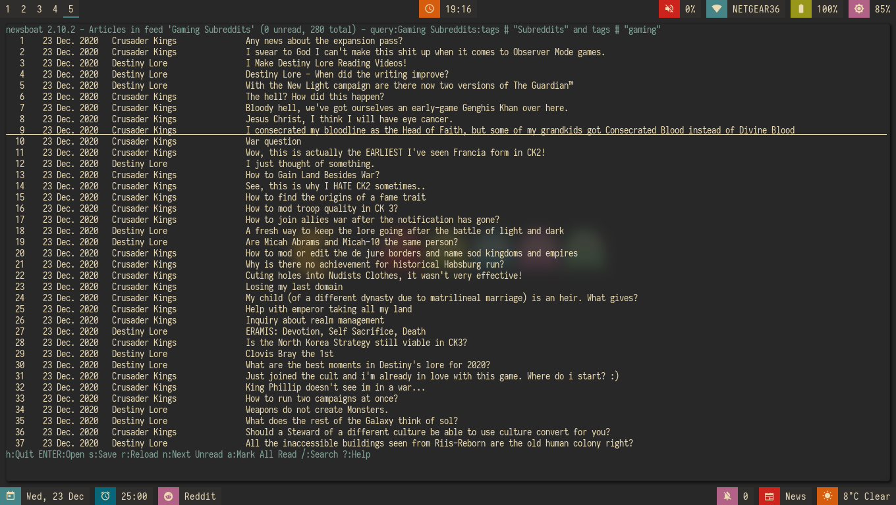

On Reddit, multireddits are a way of grouping multiple subreddits into a grouped feed. It's a nice way to keep my reddit organized so I can view the content that I really want to.

As an example, here is what my gaming-related feed in newsboat looks like:

That is incredibly overwhelming, even if it is sorted by the date the post was published.

In my opinion, even keeping all the gaming subreddits I follow in a query feed could quickly become overwhelming since I follow a lot of game-related subreddits.

As an example, I'm going to use some of the Crusader Kings and Destiny-related subreddits I follow for a gaming multireddit, but you can use whatever you want.

To start with, I created a multireddit for all the Crusader Kings-related content I wanted to follow. I called it "crusaderkings", but feel free to call it whatever you want. Once I had done that, I added several of the subreddits I wanted to follow - namely [CrusaderKings](https://reddit.com/r/CrusaderKings), [CrusaderCharacters](https://reddit.com/r/CrusaderCharacters), [CKTinder](https://reddit.com/r/CKTinder), and [CK3_DNAs](https://reddit.com/r/ck3_dnas). While this list will most likely be updated in the future, four feeds is good enough for a start. Rinse and repeat this for whatever else you want to group together - for instance, maybe you follow several subreddits for a particular programming language. Really, it's limitless what you can group by.

Once you add your individual subreddits to your multireddit, it's incredibly easy to get an rss feed of you multireddit - just add ".rss" to the end of the url. Want to change your sorting order to be with the newest posts first? Just add "/new.rss" to your url. While searching can get a tiny bit more difficult, it really isn't that much more difficult. Only want text posts? Search "self:yes", and add ".rss" just before your query and just after the search in the url. As an example, the Crusader Kings multireddit I'm using here is <https://old.reddit.com/user/jacobhilker1/m/crusaderkings.rss>.

Now, simply add the RSS url to your newsboat URLs file (usually `~/.newsboat/urls`) and you will get this when you view your multireddit feed (with my config, at least - yours may differ based on your `articlelist-view.`):



While I'd like to print the exact subreddit each post is from, I am not entirely sure how to do that without adding some sort of tag for each multireddit. If I find a way to do that, I'll update this post.

Finally, I want to group my multireddits based on a certain category. Here is an example of what mine looks like, but yours may vary based on your configuration:



Here is what it looks like when browsing a query feed:


