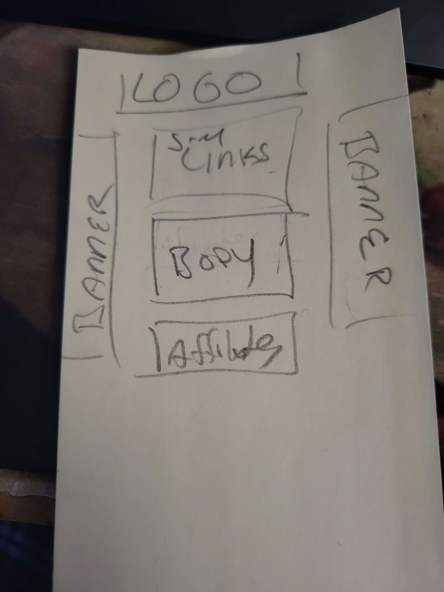

A friend of mine who plays in a metal band, Cetragore, had approached me last March about helping get his band's website up and running. While originally the band didn't have any really specific ideas for the site (beyond having a green color scheme), that friend eventually came back to me with a sketch of what he had wanted for the site:

With that in mind, I began making a [mockup](https://f57txy.csb.app/) as close as I could to the sketch (though I explained that the banners likely wouldn't look great due to some of the images I received like their most recent album cover - normally it would be a square, but a small rectagular banner would be hard to work with using a square image). 

I then continued from there, creating a sidebar with the band's logo and the important links to the band's social media pages. I then created the card in the middle of the screen, and used an iframe from Google Calendar to show the band's upcoming shows - while it is much harder to style an `iframe` compared to anything else, it made the most sense to us at the time.  Finally, I created smaller cards for each member of the band with an image and their nameplate listed at the bottom of the card.